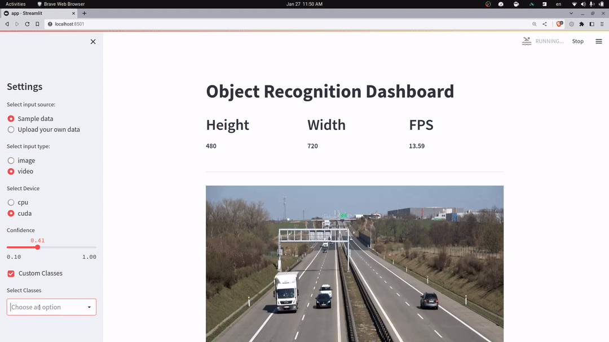

# Yolov5 Real-time Inference using Streamlit
A web interface for real-time yolo inference using streamlit. It supports CPU and GPU inference, supports both images and videos and uploading your own custom models.



### [Live Demo](https://moaaztaha-yolo-interface-using-streamlit-app-ioset2.streamlit.app/)


## Features
- **Caches** the model for faster inference on both CPU and GPU.
- Supports uploading model files (<200MB) and downloading models from URL (any size)
- Supports both images and videos.
- Supports both CPU and GPU inference.
- Supports:
  - Custom Classes
  - Changing Confidence
  - Changing input/frame size for videos


## How to run
After cloning the repo:
1. Install requirements
   - `pip install -r requirements.txt`
2. Add sample images to `data/sample_images`
3. Add sample video to `data/sample_videos` and call it `sample.mp4` or change name in the code.
4. Add the model file to `models/` and change `cfg_model_path` to its path.
```bash
git clone https://github.com/moaaztaha/Yolo-Interface-using-Streamlit
cd Yolo-Interface-using-Streamlit
streamlit run app.py
```

### To-do Next
- [x] Allow model upload (file / url).
- [x] resizing video frames for faster processing.
- [ ] batch processing, processes the whole video and then show the results.

## References
https://discuss.streamlit.io/t/deploy-yolov5-object-detection-on-streamlit/27675
